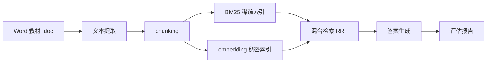

# IR-Project

基于《马克思主义基本原理》教材的检索增强问答系统，支持：
- 混合检索：BM25 + dense embedding + RRF 融合
- OpenAI 兼容中转站 API
- 可选 LLM 生成回答
- 检索评测与生成评测


### 一些细节
#### chunking 部分：
清洗文本：去掉换页符、回车、页码噪声
跳过封面/目录, 按“章/节”切分, 保留语义完整性
关键超参数：
- chunk_size=500
- overlap=100 

这意味着每个 chunk 大约 500 字，前后重叠 100 字，目的是减少边界信息丢失。\
还有两个过滤逻辑：长度小于 80 字的片段不要，“学习目标”类片段不要

#### Retrieval 部分：
hybrid 用的是 RRF（Reciprocal Rank Fusion）：
默认 rrf_k=60
每个文档贡献 1 / (rrf_k + rank)
然后把 BM25 和 dense 的排名融合
此外还有一个很重要的参数：
candidate_k=20
意思是先从 BM25 和 dense 各取前 20 个候选，再做融合，最后返回 top_5。
为什么选 hybrid：
BM25 擅长精确术语
dense 擅长语义相似
RRF 不需要手工调权重，融合更稳


#### Evaluate 部分：
检索评估

- precision@k
- recall@k
- mrr
- ndcg@k
- hit@k
含义：
P@k：前 k 个结果里有多少相关
R@k：相关文档被找回了多少
MRR：第一个相关结果排第几，越靠前越好
nDCG@k：考虑排序位置的折损
hit@k：前 k 个里是否至少命中一个相关块
生成评估

- char_f1
- keyword_coverage
含义：

char_f1：按字符级别算 F1
keyword_coverage：答案中命中了多少关键词


## 目录
- `main.py`：命令行入口
- `src/`：核心实现
- `data/`：原始文本、切块和评测集
- `indices/`：构建后的索引
- `results/`：评测结果
- `config.json`：API 与模型配置

## 配置
先编辑项目根目录的 `config.json`：

```json
{
  "api_key": "你的API_KEY",
  "base_url": "你的中转站地址",
  "embedding_model": "你的embedding模型名",
  "llm_model": "你的对话模型名"
}
```

示例：

```json
{
  "api_key": "sk-xxx",
  "base_url": "https://your-proxy.example.com/v1",
  "embedding_model": "Qwen/Qwen3-Embedding-4B",
  "llm_model": "gpt-4o-mini"
}
```

## 安装

```bash
pip install -r requirements.txt
```

## 使用

### 1. 构建索引

```bash
python main.py build
```

### 2. 查询

```bash
python main.py query "什么是马克思主义的基本特征？"
```

可选参数：
- `--top-k`：返回前几段，默认 `5`
- `--mode`：`bm25` / `dense` / `hybrid`，默认 `hybrid`
- `--llm`：启用 LLM 生成回答
- `--show-citations`：输出引用 chunk id

示例：

```bash
python main.py query "如何理解剩余价值？" --mode hybrid --llm
```

### 3. 评测

```bash
python main.py evaluate
```

会输出检索指标和生成指标，并将结果写入 `results/eval_report.json`。

#### Retrieval Evaluation Results

| Retrieval Mode | Precision@5 | Recall@5 | MRR | NDCG@5 | Hit@5 | Num Queries |
|---|---:|---:|---:|---:|---:|---:|
| BM25 | 0.7600 | 0.2305 | 0.9083 | 0.7883 | 1.0000 | 20 |
| Dense | 0.8100 | 0.2522 | 0.9500 | 0.8349 | 1.0000 | 20 |
| Hybrid (RRF) | 0.8000 | 0.2477 | 0.9667 | 0.8441 | 1.0000 | 20 |

#### Generation Evaluation Results

| Mode | Char F1 | Keyword Coverage | Num Queries |
|---|---:|---:|---:|
| Hybrid | 0.1030 | 0.8925 | 20 |

#### Experiment Settings

| Setting | Value |
|---|---:|
| Evaluation Set Size | 20 |
| Top-K | 5 |

### 4. 演示

```bash
python main.py demo
```

## 索引说明
- 建库时会同时保存 BM25、TF-IDF 组件、embedding 向量和 FAISS 索引。
- dense 检索使用 `config.json` 中的 `embedding_model`。
- 如果你更换了 embedding 模型，建议重新执行 `python main.py build` 生成新索引。


### 3. embedding 调用失败
检查 `api_key`、`base_url`、`embedding_model` 是否填写正确。

## 说明
该项目默认保留混合检索方式，不会只依赖单一 dense 检索。
